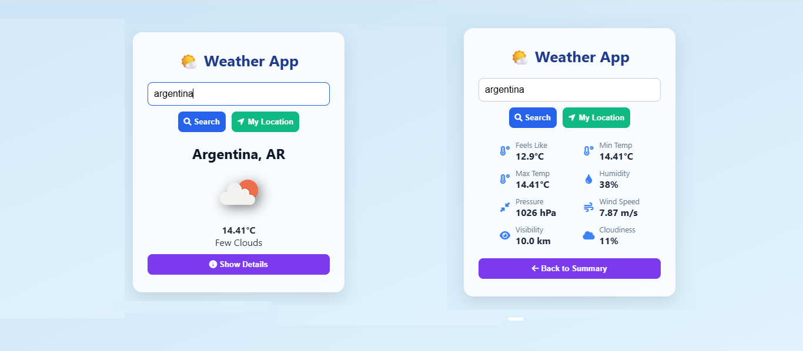

# 📍🌤️ Deatailed Weather App with Geolocation Support

This app is a 3rd project in a series and updated project of the geolocation-weather-app with geolocation functionality support & detailed weather reports. You can view the other versions here: 
1. [Basic Project](https://github.com/youknowankit/weather-app)
1. [Geolocation Project](https://github.com/youknowankit/geolocation-weather-app)
3. [Detailed Weather Project](https://github.com/youknowankit/detailed-weather-app)

  
*A detailed, clean, responsive geolcation based weather application using the OpenWeather API*

## ✨ Features
- 🔍 Search weather by **city name**
- 📍 **Get weather by your current location** (Geolocation API)
- 🌡️ Temperature in Celsius
- 🌦️ Weather condition icons & detailed weather reports
- 📱 Mobile-friendly design
- 🛡️ Error handling for invalid inputs and geolocation access denial

## 🚀 What's New
- ✅ **Geolocation Support**: The app can now fetch weather based on your current location automatically if permission is granted.
- ✅ **Detailed Weather Reports**: Now, you can view temperatures(max, min, feels like), pressure, humidity, wind speed, visibility & cloudiness.

## ⚙️ Local Setup

1. **Get an API Key** (Free):
   - Sign up at [OpenWeatherMap](https://openweathermap.org/)
   - Get your API key from [API Keys](https://home.openweathermap.org/api_keys)

2. **Clone and Run the App**:
   ```bash
   git clone https://github.com/youknowankit/detailed-weather-app.git
   cd detailed-weather-app
